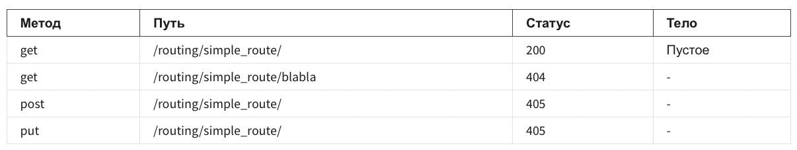
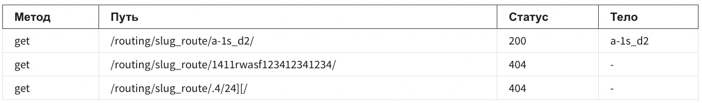
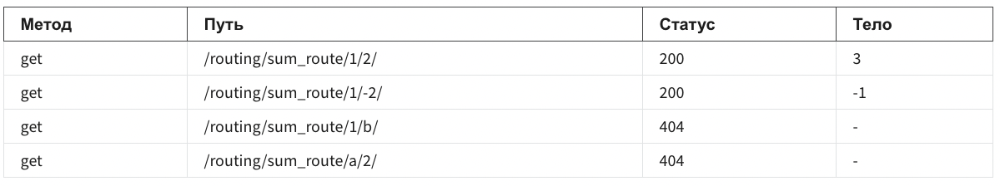
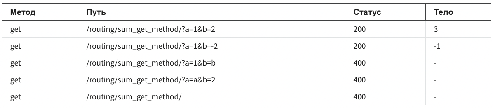
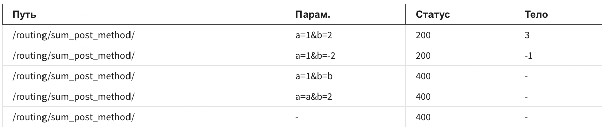

## Практическое задание по routing

В этом задании вы научитесь строить навигацию веб приложения, писать view, которые умеют получать и оперировать 
различными параметрами из запроса (параметры из URL, GET параметры, POST параметры), и формировать простые HTTP 
ответы с различными статусами.

Для выполнения задания необходимо использовать шаблон [проекта](https://github.com/alexopryshko/coursera_assignment_tmp)

View, которые необходимо отредактировать, находятся в **routing/views.py**, urls - **routing/urls.py**. 

Решение должно быть **zip** архивом. Обратите внимание, что название архива не должно содержать кириллицу и пробелы 
(допустимые символы - буквы латинского алфавита и символ нижнего подчеркивания, например: routing.zip, 
solution_routing.zip и т.д.) . В архиве должно содержаться два файла, которые вы редактировали ранее (обратите 
внимание, название файлов должно быть именно таким): **urls.py, views.py**  

1. Нужно написать view **simple_route**, которая формирует http ответ с пустым телом со статусом 200 на запрос GET 
   (если запросы отличные от GET - возвращать 405) по /routing/simple_route/:

Кейсы:

**Замечание:** "-" в столбце "тело" означает, что в грейдере тело не проверяется

2. slug_route - нужно написать view, которая принимает slug и отдает его в теле ответа. В slug допустимы символы: 
   0-9, a-z, -, _ . Минимальная длина 1 символ, максимальная длина 16. 

Кейсы:

3. **sum_route** - нужно написать view, которая принимает 2 числа и их суммирует, например /routing/sum_route/1/2/

Кейсы:

4. **sum_get_method** - нужно написать view, которая принимает 2 числа из GET параметров a и b и суммирует их. 
   Допускается только метод GET. Например /routing/sum_get_method/?а=1&b=2 

Кейсы:

5. **sum_post_method** - нужно написать view, которая принимает 2 числа из POST параметров a и b и суммирует их. 
   Допускается только метод POST. Например /routing/sum_post_method/ 

Кейсы:

